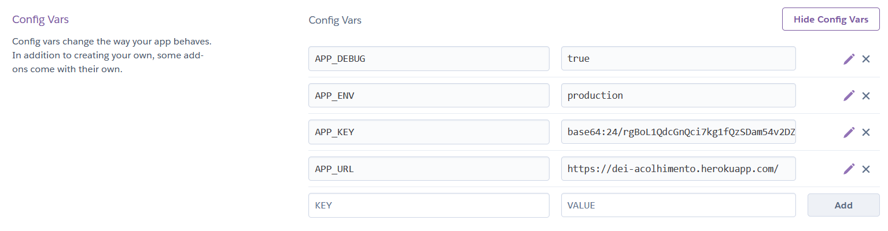
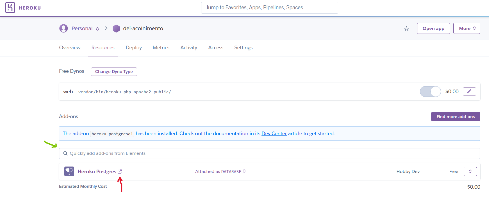
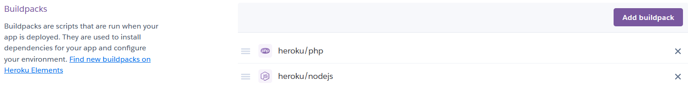
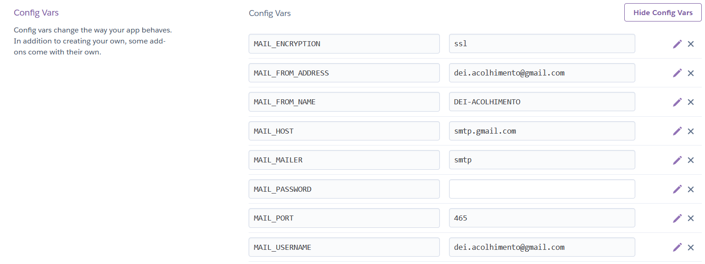

# Heroku Deploy Manual

## 1) Heroku Account

- Create a new heroku account at https://signup.heroku.com/

- Or sign in to a your account at https://id.heroku.com/login

## 2) Download Heroku Toolbelt
- Available at https://devcenter.heroku.com/articles/heroku-cli

- After that, in your terminal, run the command the following command, and log into your Heroku Account

```shell
heroku login
```

## 3) Create New Heroku App

- In the Heroku Dashboard create a new app, or run this command in the terminal (you can skip this if app is already created)

```shell
heroku create
```

## 4) Deploy using Heroku git

- First we need to setup the remote to point to our app name, witch can be found in the terminal after the **heroku create** command or in the heroku dashboard. Usually it's something like **powerful-falls-60752**

```shell
heroku git:remote -a [APP NAME]
```
In our case [APP NAME] is dei-acolhimento

- After this we need to push to the heroku repository

```shell
git subtree push --prefix src heroku main
```

## 5) Config Environment Variables

- This can be done using the terminal, with commands like:

```shell
heroku config:add APP_NAME=dei-acolhimento
```
- But is simpler if you go to the Heroku Dashboard on your browser > Settings > Reveal Config Vars



- App_Key can be found in /src/.env

## 6) Setup Database

- Now we need to go to **Resources > Add-ons** and on the green arrow add Heroku-Postgres as the database



- After this we can check our DB credentials by clicking on the red arrow or running on the terminal

```shell
heroku pg:credentials:url
```

- Just like in point 5) we need to set up the env variables for the DB (change values inside brackets accordingly or use heroku dashboard in your browser)

```shell
heroku config:add DB_CONNECTION=pgsql;
heroku config:add DB_HOST=[INSERT HERE];
heroku config:add DB_DATABASE=[INSERT HERE];
heroku config:add DB_USERNAME=[INSERT HERE];
heroku config:add PASSWORD=[INSERT HERE];
```

- Now we just need to run the migrate and DB seed commands inside heroku

```shell
heroku run php artisan migrate;
heroku run php artisan db:seed;
```

## 7) Add Nodejs in Buildpacks



- Go to Settings > Buildpacks, add nodejs, commit and push the changes to heroku

```shell
git subtree push --prefix src heroku main
```

## 8) Setup Email

- In order to setup the email provider to register/recover account we can change the values accordingly and run the following command:
```shell
heroku config:add MAIL_ENCRYPTION=ssl;
heroku config:add MAIL_FROM_ADDRESS=[INSERT HERE];
heroku config:add MAIL_FROM_NAME=[INSERT HERE];
heroku config:add MAIL_HOST=[INSERT HERE];
heroku config:add MAIL_MAILER=[INSERT HERE];
heroku config:add MAIL_PASSWORD=[INSERT HERE];
heroku config:add MAIL_PORT=[INSERT HERE];
heroku config:add MAIL_USERNAME=[INSERT HERE];
```

- Or change them in the heroku dashboard



<br><hr><br>

This tutorial is slightly adapted from https://youtu.be/639Pe0PpVLQ